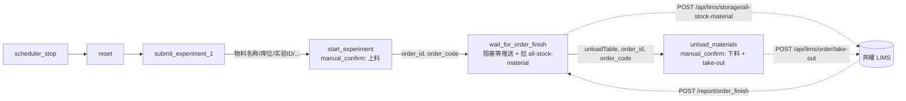

# Sirna 工作站新增「等待订单完成」+「人工下料」两个节点 Plan

> 日期: 2026-05-26
> 目标文件: [`unilabos/devices/workstation/bioyond_studio/sirna_station/sirna_station.py`](../unilabos/devices/workstation/bioyond_studio/sirna_station/sirna_station.py)
> 共享 RPC: [`unilabos/devices/workstation/bioyond_studio/bioyond_rpc.py`](../unilabos/devices/workstation/bioyond_studio/bioyond_rpc.py)
> 基类回调链: [`unilabos/devices/workstation/bioyond_studio/station.py`](../unilabos/devices/workstation/bioyond_studio/station.py) `process_order_finish_report`
> 参考实现:
> - [`bioyond_cell_workstation.py`](../unilabos/devices/workstation/bioyond_studio/bioyond_cell/bioyond_cell_workstation.py) `wait_for_order_finish` / `wait_for_order_finish_polling` / `process_order_finish_report`
> - [`temp_benyao/peptide/_plans/2026-05-20_add_two_node.md`](../temp_benyao/peptide/_plans/2026-05-20_add_two_node.md) Peptide 同主题草稿
> - [`sirna_station.py:1130` `start_experiment`](../unilabos/devices/workstation/bioyond_studio/sirna_station/sirna_station.py)（上一节点模板）
> - [`sirna_station.py:1306` `end_experiment`](../unilabos/devices/workstation/bioyond_studio/sirna_station/sirna_station.py)（manual_confirm 节点风格参考）
> 状态: 仅设计，不写代码

---

## 一、需求背景

截图里的四个已有节点按工作流方向是：

```
scheduler_stop  →  reset  →  submit_experiment_1  →  start_experiment
                                       │                     │
                                       └──(物料名称/库位/实验ID/...)──> 上料 manual_confirm
```

`start_experiment`（[sirna_station.py:1130](../unilabos/devices/workstation/bioyond_studio/sirna_station/sirna_station.py)）完成后只是调用了 `rpc.scheduler_start()`，工作流图上就到此结束。这次要把完整闭环补全，加两个节点接在 `start_experiment` 之后：

```
... → start_experiment → wait_for_order_finish → unload_materials
```

业务诉求：

1. **任务等待节点 `wait_for_order_finish`**：阻塞等待奔耀通过 `POST /report/order_finish` 推送任务完成（见 [飞书 报送服务文档](https://dptechnology.feishu.cn/wiki/DiGVwwyaPit9vPkDkd5cSjbSnBc)）。收到匹配 orderCode 的推送后，立即调用新接口 `POST /api/lims/storage/all-stock-material`（见 [飞书 补充接口文档](https://dptechnology.feishu.cn/wiki/V18PwA9xUiahZpkzxRbc8m9OnMh)）拉取该 orderId 当前实验台上所有物料，整理成「下料指引表」传给下游。
2. **下料节点 `unload_materials`**：`manual_confirm` 节点。展示上一节点整理出的物料表给操作员，操作员物理取出后勾选「已完成物理下料」；勾选后调用 `POST /api/lims/order/take-out`（共享 RPC `bioyond_rpc.take_out`）通知奔耀下料完成，并把返回包 `success/code/message` 透出。

---

## 二、用户决策（已确认）

| # | 决策 | 取值 |
|---|------|------|
| 1 | 下料节点交互形式 | **manual_confirm**：阻塞展示物料表→等待操作员勾选→调用 take-out |
| 2 | take-out 的 `preintakeIds` / `materialIds` 来源 | **传 `[]` / `[]`**：只传 `orderId`，让奔耀按订单自己决定取出范围 |
| 3 | `all-stock-material` 的 `orderId` 来源 | **wait 节点入参 `order_id`**：直接接收上游 `start_experiment.order_id` 输出 handle；不从 `/report/order_finish` 推送报文里反推 |
| 4 | 下料表列结构 | 与上料表 `_build_result_table` 对齐的 **4 列**：设备 / 位置 / 物料名称 / 数量；数据来自 `all-stock-material` 返回的 `locations[0].whName`、`locations[0].code`、`name`、`quantity` |

> 决策 2 直接简化了下游：`unload_materials` 不需要从 `all-stock-material` 或 `usedMaterials` 反推 ID 列表去喂 take-out；它只负责"展示给人看 + 勾选后通知 Bioyond"。`all-stock-material` 的数据只用来**给操作员看下料指引**，不进 take-out 请求体。
>
> 决策 3 明确两类 ID 的职责拆分：`order_id`（UUID） 只用来调 `all-stock-material`，`order_code`（业务编号字符串）只用来匹配 `/report/order_finish` 推送。两个都从上游 `start_experiment` 输出 handle 拿，不需要反查（若 `order_code` 上游未传，节点内部保留通过 `rpc.order_report(order_id).code` 兜底反查的能力，仅作为容错；不影响 `all-stock-material` 调用形参）。

---

## 三、新增 / 修改的接口与代码

### 3.1 `bioyond_rpc.py` 新增 `all_stock_material` RPC 方法

仿照现有 `stock_material`（[`bioyond_rpc.py:84`](../unilabos/devices/workstation/bioyond_studio/bioyond_rpc.py)）追加一个新方法。**不复用 `stock_material`**，因为：

- URL 不同：`/api/lims/storage/all-stock-material` vs `/api/lims/storage/stock-material`。
- 入参不同：必填 `orderId`，可选 `typeMode`；`stock_material` 入参是 `typeMode`/`filter`/`includeDetail`。
- 返回语义不同：`all-stock-material` 同时返回 `isUse=true` 和 `isUse=false` 的物料，且新增 `typeMode`（字符串 `"Sample"`/`"Reagent"`/`"Consumables"`）字段。

签名（设计，不实现）：

```python
def all_stock_material(self, json_str: str) -> list:
    """拉取订单当前实验台上的全部物料（isUse=true/false）。

    json_str 示例:
        '{"orderId": "<uuid>", "typeMode": 0}'   # typeMode 可选，缺省返回全部类型

    返回:
        list[dict]: 失败或 code != 1 时返回空 list；
                    成功时返回 response['data']（数组），每项含 id/code/name/typeMode/locations 等。
    """
```

实现要点（设计）：

- `params = json.loads(json_str)`；缺失 `orderId` 时记 `self._logger.error` 后返回 `[]`，与 `stock_material` 同样的容错风格。
- POST 到 `f"{self.host}/api/lims/storage/all-stock-material"`，请求体包 `{"apiKey", "requestTime", "data": params}`。
- `response.code != 1` 返回 `[]`。

### 3.2 `BioyondSirnaStation.__init__` / `post_init` 追加事件字段

参考 [`bioyond_cell_workstation.py:110-114`](../unilabos/devices/workstation/bioyond_studio/bioyond_cell/bioyond_cell_workstation.py)：

```python
self.order_finish_event: threading.Event = threading.Event()
self.last_order_code: Optional[str] = None
self.last_order_report: Optional[Dict[str, Any]] = None
self.last_used_materials: List[Any] = []
```

- 加 `import threading` 到文件顶部（当前没有）。
- 字段放在最末尾的初始化块，避免和现有 `_last_submitted_order_*` 之类字段相互覆盖。
- 不依赖 `bioyond_config["_disable_auto_http_service"]`：基类 `BioyondWorkstation` 已经在 `post_init` 里启动 `WorkstationHTTPService`，sirna 沿用默认即可，**不复制 cell 的子线程启动逻辑**。

> 校验：sirna 当前没有 override `_start_http_service`，事件字段必须在基类 HTTP 服务启动之前赋值完毕，避免推送先到、字段未建的竞态。建议放在 `post_init` 开头或 `__init__` 最末（在 `super().__init__` 之后）。

### 3.3 override `process_order_finish_report`

在 `BioyondSirnaStation` 上新增：

```python
def process_order_finish_report(self, report_request, used_materials=None):
    base_result = super().process_order_finish_report(report_request, used_materials or [])
    data = getattr(report_request, "data", {}) or {}
    order_code = str(data.get("orderCode") or "")

    self.last_order_report = data
    self.last_used_materials = list(used_materials or [])

    if self.last_order_code and order_code == self.last_order_code:
        logger.info(f"[sirna] order_finish 匹配 orderCode={order_code}，触发 event")
        self.order_finish_event.set()
    else:
        logger.info(
            f"[sirna] order_finish 不匹配当前等待: expected={self.last_order_code} got={order_code}"
        )
    return base_result
```

关键点：

- **必须先调 `super().process_order_finish_report(...)`**，保留基类的 `_publish_task_status` 和 `resource_synchronizer.sync_from_external()` 副作用（[`station.py:1597-1600`](../unilabos/devices/workstation/bioyond_studio/station.py)）。
- `used_materials` 在基类是 `List`（必填），override 里给个默认 `None` → `[]`，避免单元测试不传时崩。
- orderCode 匹配语义和 cell workstation 一致（[`bioyond_cell_workstation.py:168-176`](../unilabos/devices/workstation/bioyond_studio/bioyond_cell/bioyond_cell_workstation.py)）：仅当 `self.last_order_code` 非空且严格相等才 `set()`，避免别的订单完成把当前 wait 节点唤醒。
- 不匹配的推送：仅记日志，不抛、不清状态。
- 推送可能在 `wait_for_order_finish` 入口设置 `last_order_code` 之前就到达 → 此时不会触发 event；这是已知边界，详见 §六-3 风险。

### 3.4 给 `start_experiment` 补输出 handle

当前 `start_experiment`（[sirna_station.py:1130](../unilabos/devices/workstation/bioyond_studio/sirna_station/sirna_station.py)）只有输入 handle，没有输出 handle。`wait_for_order_finish` 需要 `order_id` 作为输入；如果不补 `start_experiment` 的输出，工作流图就只能从 `submit_experiment_1` 拉一根线穿过 `start_experiment` 直达 wait 节点，连线会拐弯且不直观。

建议追加输出 handles（最小集）：

| key | data_type | label | data_key |
|-----|-----------|-------|----------|
| `order_id` | `bioyond_order_id` | 实验ID | `start_experiment.order_id` |
| `order_ids` | `bioyond_order_ids` | 实验ID列表 | `start_experiment.order_ids` |
| `order_code` | `bioyond_order_code` | 订单编号 | `start_experiment.order_code` |

同时在 `start_experiment` 返回字典里补 `order_id` / `order_ids` / `order_code` 三个字段（值从已有 `start_info` 里取）。这不是行为变更，只是把内部数据曝光给下游节点连线。

---

## 四、节点 1：`wait_for_order_finish`（阻塞等待 + 整理物料）

### 4.1 装饰器

```python
@action(
    always_free=True,
    goal_default={
        "order_id": "",
        "order_code": "",
        "timeout_seconds": 36000,    # 10h，与 cell workstation 默认对齐
        "poll_mode": True,           # 默认走轮询，让出 ROS2 feedback 派发线程
    },
    description="阻塞等待奔耀 /report/order_finish 推送，并通过 all-stock-material 整理下料指引表",
    handles=[
        # 输入：可直接接 start_experiment / submit_experiment_1 的 order_id
        ActionInputHandle(key="order_id",   data_type="bioyond_order_id",   label="实验ID",
                          data_key="order_id",   data_source=DataSource.HANDLE, io_type="source"),
        ActionInputHandle(key="order_ids",  data_type="bioyond_order_ids",  label="实验ID列表",
                          data_key="order_ids",  data_source=DataSource.HANDLE, io_type="source"),
        ActionInputHandle(key="order_code", data_type="bioyond_order_code", label="订单编号",
                          data_key="order_code", data_source=DataSource.HANDLE, io_type="source"),
        # 输出
        ActionOutputHandle(key="order_id",            data_type="bioyond_order_id",     label="实验ID",
                           data_key="order_id",            data_source=DataSource.EXECUTOR),
        ActionOutputHandle(key="order_code",          data_type="bioyond_order_code",   label="订单编号",
                           data_key="order_code",          data_source=DataSource.EXECUTOR),
        ActionOutputHandle(key="order_finish_status", data_type="string",               label="完成状态",
                           data_key="order_finish_status", data_source=DataSource.EXECUTOR),
        ActionOutputHandle(key="order_finish_report", data_type="object",               label="订单完成推送报文",
                           data_key="order_finish_report", data_source=DataSource.EXECUTOR),
        ActionOutputHandle(key="used_materials",      data_type="array",                label="使用物料列表",
                           data_key="used_materials",      data_source=DataSource.EXECUTOR),
        ActionOutputHandle(key="all_stock_materials", data_type="array",                label="实验台全部物料",
                           data_key="all_stock_materials", data_source=DataSource.EXECUTOR),
        ActionOutputHandle(key="unloadTable",         data_type="object",               label="下料指引表",
                           data_key="unloadTable",         data_source=DataSource.EXECUTOR, io_type="target"),
    ],
)
def wait_for_order_finish(
    self,
    order_id: str = "",
    order_code: str = "",
    timeout_seconds: int = 36000,
    poll_mode: bool = True,
    **kwargs: Any,
) -> Dict[str, Any]:
    ...
```

### 4.2 主流程（伪代码）

`order_id` 直接由上游 `start_experiment.order_id` 通过输入 handle 喂进来；本节点不做 `order_id` 反查。
`order_code` 主要也由上游 `start_experiment.order_code` 喂进来，仅作为 `/report/order_finish` 推送匹配的 key；
若上游未连 `order_code`，节点内部仍保留 `rpc.order_report(order_id).code` 的兜底反查，纯粹是容错——
**`order_code` 不参与 `all-stock-material` 请求体**。

```text
1. resolve order_id / order_code
   - 把 order_id, order_code 从 self._kwarg_text(kwargs, ...) 兜底一次
   - order_id 必填（用于推送匹配的兜底反查 + 调用 all-stock-material）：
        若未提供，且 order_ids 长度==1，取 order_ids[0]；
        若 order_ids 长度>1 且未指定 order_id/order_code → raise（避免误选订单）
   - 若 order_code 为空且 order_id 非空（兜底反查；仅用于推送匹配，不参与 all-stock-material）:
        report = rpc.order_report(order_id) 现有路径
        order_code = report.get("code") or report.get("orderCode") or ""
   - 若 order_code 仍为空 → raise ValueError("wait_for_order_finish 需要 order_code 或可解析的 order_id")

2. 准备等待状态
   self.last_order_code = order_code
   self.last_order_report = None
   self.last_used_materials = []
   self.order_finish_event.clear()

3. 阻塞等待
   if poll_mode:
       仿 bioyond_cell_workstation.wait_for_order_finish_polling，0.5s 轮询 + 超时；
       这样 ROS2 在等待期间还能派发 feedback。
   else:
       self.order_finish_event.wait(timeout=timeout_seconds)
   超时 → status="timeout"，跳到步骤 6 用空报文返回。

4. 解析推送状态（沿用 cell workstation 语义）
   raw_status = str(self.last_order_report.get("status", ""))
   status = {
       "30":  "success",
       "-11": "abnormal_stop",
       "-12": "manual_stop",
   }.get(raw_status, f"unknown_{raw_status}" if raw_status else "missing_status")

5. 拉取实验台物料（用 order_id，不是 order_code！）
   # 仅 status in {success, abnormal_stop, manual_stop} 时调用，timeout/未知状态跳过。
   rpc = self._require_hardware_interface("all_stock_material")
   all_materials_json = json.dumps({"orderId": order_id}, ensure_ascii=False)  # typeMode 不传 → 全部类型
   all_materials = rpc.all_stock_material(all_materials_json) or []

6. 整理 unloadTable（4 列：设备 / 位置 / 物料名称 / 数量，与上料表 _build_result_table 对齐）
   unload_rows = []
   for mat in all_materials:
       material_name = str(mat.get("name") or "")
       top_quantity = mat.get("quantity")
       locations = mat.get("locations") or []
       if not locations:
           # 没有 location 时仍保留一行空坐标占位，提示操作员该物料无法定位。
           unload_rows.append({
               "whName":       "",
               "locationCode": "",
               "materialName": material_name,
               "quantity":     "" if top_quantity is None else str(top_quantity),
           })
           continue
       for loc in locations:
           if not isinstance(loc, dict):
               continue
           # 同名物料多库位时按 location 拆多行，方便操作员一对一物理取出。
           loc_quantity = loc.get("quantity")
           if loc_quantity is None:
               loc_quantity = top_quantity
           unload_rows.append({
               "whName":       str(loc.get("whName") or ""),
               "locationCode": str(loc.get("code") or ""),
               "materialName": material_name,
               "quantity":     "" if loc_quantity is None else str(loc_quantity),
           })
   unloadTable = self._build_unload_table(unload_rows)  # 见 §4.3

7. 返回
   return {
       "success": status in {"success", "abnormal_stop", "manual_stop"},   # 超时/未知 → False
       "order_id":              order_id,
       "order_code":            order_code,
       "order_finish_status":   status,
       "order_finish_report":   self.last_order_report or {},
       "used_materials":        [self._used_material_to_dict(m) for m in self.last_used_materials],
       "all_stock_materials":   all_materials,
       "unloadTable":           unloadTable,
       "confirmation_message":  f"任务完成: status={status}; 已整理 {len(unload_rows)} 行下料指引",
   }
```

### 4.3 新增常量 `UNLOAD_TABLE_COLUMNS`

放在 `sirna_station.py` 顶部常量区，与上料表 `_build_result_table` 的列定义对齐（4 列、`{"name", "key"}` 格式）：

```python
UNLOAD_TABLE_COLUMNS: List[Dict[str, str]] = [
    {"name": "设备",     "key": "whName"},
    {"name": "位置",     "key": "locationCode"},
    {"name": "物料名称", "key": "materialName"},
    {"name": "数量",     "key": "quantity"},
]
```

`_build_unload_table` 直接把该常量作为 `columns` 字段（不再做 `label`→`name` 翻译）：

```python
@staticmethod
def _build_unload_table(
    unload_rows: List[Dict[str, Any]],
    table_name: str = "下料指引",
) -> Dict[str, Any]:
    return {
        "data": list(unload_rows or []),
        "columns": list(UNLOAD_TABLE_COLUMNS),
        "tableName": table_name,
    }
```

> 与上料表对齐的好处：前端可以复用上料表的渲染逻辑，操作员体验也一致——「设备 / 位置 / 物料名称 / 数量」是装/卸物料场景里最关键的 4 列。
>
> 取舍：去掉的列（坐标 X/Y/Z、单位、物料编码、物料类型、是否使用）改为放进 `all_stock_materials` 原始数组的输出 handle（已存在），需要时下游/调试可以从原始数据里拿到。

### 4.4 多订单情况

当 `order_ids` 长度 > 1 时（实测 sirna 当前 borderNumber=1，多订单概率低，但 submit 接口已支持）：

- **本节点 v1 不做多订单循环等待**：只用第一个 `order_id` / 显式传入的 `order_code`。
- 工作流图层面：如果未来需要并发等多个订单，让上层多拉几个 `wait_for_order_finish` 节点并行；这条决策必须写在节点 `description` 第二行，避免误用。
- 单元测试需覆盖 `order_ids=["a","b"]` 且未传 `order_id`/`order_code` 时的退化行为（取 `order_ids[0]` 还是 raise，待人类下次确认；建议 v1 raise 提示「请指定 order_id」）。

---

## 五、节点 2：`unload_materials`（manual_confirm + take-out）

### 5.1 装饰器

```python
@action(
    always_free=True,
    node_type=NodeType.MANUAL_CONFIRM,
    placeholder_keys={
        "unloadTable":        "unilabos_manual_confirm",
        "assignee_user_ids":  "unilabos_manual_confirm",
    },
    goal_default={
        "order_id":          "",
        "materials_unloaded": False,
        "timeout_seconds":    3600,
        "assignee_user_ids":  [],
    },
    feedback_interval=300,
    description=(
        "展示上一节点整理的下料指引表；操作员物理取出后勾选 materials_unloaded=True，"
        "本节点再调用 /api/lims/order/take-out 通知奔耀下料完成。"
    ),
    handles=[
        ActionInputHandle(key="order_id",            data_type="bioyond_order_id",     label="实验ID",
                          data_key="order_id",            data_source=DataSource.HANDLE, io_type="source"),
        ActionInputHandle(key="order_code",          data_type="bioyond_order_code",   label="订单编号",
                          data_key="order_code",          data_source=DataSource.HANDLE, io_type="source"),
        ActionInputHandle(key="unloadTable",         data_type="object",               label="下料指引表",
                          data_key="unloadTable",         data_source=DataSource.HANDLE, io_type="source"),
        ActionInputHandle(key="used_materials",      data_type="array",                label="使用物料列表",
                          data_key="used_materials",      data_source=DataSource.HANDLE, io_type="source"),
        ActionInputHandle(key="order_finish_report", data_type="object",               label="订单完成推送报文",
                          data_key="order_finish_report", data_source=DataSource.HANDLE, io_type="source"),
        ActionOutputHandle(key="success",         data_type="boolean",            label="是否成功",
                           data_key="success",         data_source=DataSource.EXECUTOR),
        ActionOutputHandle(key="order_id",        data_type="bioyond_order_id",   label="实验ID",
                           data_key="order_id",        data_source=DataSource.EXECUTOR),
        ActionOutputHandle(key="take_out_result", data_type="object",             label="take-out 返回包",
                           data_key="take_out_result", data_source=DataSource.EXECUTOR),
    ],
)
def unload_materials(
    self,
    order_id: str = "",
    materials_unloaded: bool = False,
    timeout_seconds: int = 3600,
    assignee_user_ids: Optional[List[str]] = None,
    **kwargs: Any,
) -> Dict[str, Any]:
    ...
```

### 5.2 主流程（伪代码）

```text
1. del timeout_seconds, assignee_user_ids   # 框架参数，本动作不用
   order_id = (order_id or "").strip() or self._kwarg_text(kwargs, "order_id")

2. 校验：上一节点必须传 unloadTable / order_id；缺一即 raise
   if not order_id:
       raise ValueError("unload_materials 需要 order_id（请连上 wait_for_order_finish.order_id）")

3. 人工确认门禁
   if not self._as_manual_gate(materials_unloaded):
       raise RuntimeError("下料未确认，拒绝调用 take-out")

4. 调 take-out（关键决策：传空 ID 列表）
   rpc = self._require_hardware_interface("take_out")
   self._require_rpc_method(rpc, "take_out")
   take_out_response = rpc.take_out(order_id, [], [])
   success = bool(take_out_response.get("code") == 1) if isinstance(take_out_response, dict) else False

5. 返回
   return {
       "success":         success,
       "order_id":        order_id,
       "take_out_result": take_out_response,
       "confirmation_message": (
           "下料确认，已通知奔耀 take-out 成功"
           if success
           else "下料确认，但 take-out 返回失败/异常，请检查 LIMS 状态"
       ),
   }
```

### 5.3 与 `end_experiment` 的关系

现有 `end_experiment`（[sirna_station.py:1306](../unilabos/devices/workstation/bioyond_studio/sirna_station/sirna_station.py)）做的是**清理本地 deck 资源树**（按 `unilabos_extra.order_id` 过滤后从 PLR deck 上 remove 资源），不调 take-out，也不等推送。

`unload_materials` 与 `end_experiment` **职责不重叠**：

- `unload_materials`：通知奔耀「下料完成」（外部副作用）。
- `end_experiment`：清空本地 PLR 资源树（内部副作用）。

工作流图上两者可以并存或择一，**本 plan 不删除 `end_experiment`**。如果未来想合并，需要新建独立 plan，并保留 `end_experiment` 现有 `unload_tables` 输出 handle 以免破坏既有工作流。

---

## 六、端到端工作流连线（更新后）



---

## 七、影响面与兼容性

| 文件 | 改动 | 风险 |
|------|------|------|
| `unilabos/devices/workstation/bioyond_studio/bioyond_rpc.py` | 新增 `all_stock_material()` 一个方法 | 仅新增，不改既有；其他工作站不受影响 |
| `unilabos/devices/workstation/bioyond_studio/sirna_station/sirna_station.py` | ① 顶部 `import threading`、`UNLOAD_TABLE_COLUMNS` 常量；② `BioyondSirnaStation` 字段 / `process_order_finish_report` override / 两个新 action `wait_for_order_finish` + `unload_materials`；③ 给 `start_experiment` 补 3 个输出 handle 和返回字段 | `start_experiment` 输出 handle 增加是兼容性最敏感的点，需测试既有工作流不会因为多余 key 报错 |
| `unilabos/devices/workstation/bioyond_studio/station.py` | **不动** | override 中保留 `super().process_order_finish_report()` 调用 |
| `unilabos/devices/workstation/workstation_http_service.py` | **不动** | 基类已注册 `/report/order_finish` 路由 |

兼容性要点：

1. sirna 当前没有自己的 HTTP 服务子线程（不像 `bioyond_cell_workstation`），全靠基类 `BioyondWorkstation.post_init` 启动 `WorkstationHTTPService`。本 plan **不引入** sirna 专属 HTTP 服务，只依赖基类的 `update_push_ip` + `WorkstationHTTPService`，避免重复启动。
2. `process_order_finish_report` override 严格保留 `super().process_order_finish_report()` 调用顺序，**保证基类的 `resource_synchronizer.sync_from_external()` 副作用仍在 30 状态下触发**，不破坏现有"任务完成自动同步物料"语义。
3. `start_experiment` 输出 handle 新增是**纯新增字段**，不删除/重命名既有 handle；下游已有工作流不会失效。
4. `wait_for_order_finish` / `unload_materials` 与 `end_experiment` 并存；工作流编辑器里用户可以三选一或自由组合。

---

## 八、测试计划

新增/更新测试目标（建议路径，按现有 sirna 测试组织风格调整）：

| 测试 | 文件 | 覆盖 |
|------|------|------|
| `all_stock_material` payload | `tests/devices/workstation/test_bioyond_rpc.py` | 验证 POST URL = `/api/lims/storage/all-stock-material`；data 包含 `orderId`；缺 `orderId` 时返回 `[]` 且记日志 |
| `process_order_finish_report` override | `tests/devices/workstation/test_sirna_actions.py` | ① 调用必先触发 `super()`（mock 基类 assert called once）；② orderCode 匹配 `self.last_order_code` 时 `event.is_set()` 为真；③ orderCode 不匹配时 `event.is_set()` 仍为假 |
| `wait_for_order_finish` 事件路径 | `tests/devices/workstation/test_sirna_actions.py` | ① 事件提前 set + status="30" → 返回 success；② 超时 → status=`timeout`、success=False、不调 `all_stock_material`；③ status=`-11` → `abnormal_stop`，仍调 `all_stock_material` |
| `wait_for_order_finish` 入参兜底 | 同上 | ① 只传 `order_id` 不传 `order_code`：mock `order_report` 返回 `{"code": "EXP-001"}` 后能正确 resolve；② 两个都不传 → raise |
| `wait_for_order_finish` `all_stock_material` 整理 | 同上 | 给 fake rpc 灌入 1 条带 `locations[0].whName/x/y/z` 的物料 → `unloadTable.data` 列含正确 `whName/posX/posY/posZ/unit/materialName/typeMode` |
| `unload_materials` 门禁 | 同上 | `materials_unloaded=False` → raise；`materials_unloaded=True` 且 `order_id=""` → raise |
| `unload_materials` take-out 透传 | 同上 | `materials_unloaded=True, order_id="abc"` → fake rpc 收到 `take_out("abc", [], [])`；返回包 `{"code":1}` → success=True；`{"code":99}` → success=False |
| `start_experiment` 输出 handle | `tests/devices/workstation/test_sirna_actions.py` | AST 扫描后 `start_experiment` 的输出 handles 中包含 `order_id`、`order_code`、`order_ids`，且 `data_key` 对得上返回 dict 字段 |

测试组装策略沿用 [`2026-05-25_sirna_rpc_action_split_cleanup_plan.md`](2026-05-25_sirna_rpc_action_split_cleanup_plan.md) §Test Plan 的做法：

- station 行为测试：`object.__new__(BioyondSirnaStation)` + 手动注入 `hardware_interface`/`bioyond_config`/`order_finish_event`/`last_order_code` 等字段，避免 ROS/HTTP boot。
- RPC payload 测试：`object.__new__(BioyondV1RPC)` + 设置 `host`/`api_key`/`_logger`，monkeypatch `post`。

---

## 九、验收清单

- [ ] `bioyond_rpc.py` 存在 `all_stock_material(self, json_str: str) -> list`，URL = `/api/lims/storage/all-stock-material`。
- [ ] `BioyondSirnaStation.__init__` / `post_init` 后存在 `order_finish_event`/`last_order_code`/`last_order_report`/`last_used_materials` 字段。
- [ ] `BioyondSirnaStation.process_order_finish_report` 存在，且必调 `super()`。
- [ ] `wait_for_order_finish` 是 normal action（非 manual_confirm），输出 handle 含 `order_id`/`order_code`/`order_finish_status`/`order_finish_report`/`used_materials`/`all_stock_materials`/`unloadTable`。
- [ ] `unload_materials` 是 `manual_confirm`，输入含 `order_id`+`unloadTable`，`materials_unloaded=False` 时 raise，`True` 时 take-out 调用为 `rpc.take_out(order_id, [], [])`。
- [ ] `start_experiment` 输出 handle 新增 `order_id`/`order_ids`/`order_code` 三项，返回字典含相应键。
- [ ] 不删除/不改名既有 action；`end_experiment` 行为不变。
- [ ] `unload_materials` 不解析 `unloadTable` 内容、不从 `all_stock_materials` 提取 ID 喂 take-out；仅传 `[]`/`[]`。
- [ ] 单元测试全部通过；新加测试覆盖 §八 列出的全部用例。
- [ ] sirna 工作流图能从 `start_experiment` 拖一根 `order_id` 线到 `wait_for_order_finish`，再从 wait 拖 `unloadTable` + `order_id` 到 `unload_materials`，整条链路绿色无错。

---

## 十、待人类下次确认（不阻塞 v1 开发）

1. **多订单等待策略**：当前 v1 只等 `order_id` 或显式 `order_code` 中的"那一笔"，多 order_ids 直接 raise；未来如果 sirna 真有多 borderNumber 场景，是否要让 wait 节点循环等所有？
2. **`order_code` 反查路径**：当前设计走 `rpc.order_report(order_id)` 取 `code` 字段；如果 sirna 后续做 `2026-05-25_sirna_rpc_action_split_cleanup_plan.md` Phase 4 的 envelope 改造，反查路径要切到 `return_envelope=True` 并显式从 envelope 拿 `data.code`。
3. **`unloadTable` 是否区分 `typeMode`**：v2 已简化为 4 列、所有物料合并成一张表；若操作员习惯按"样品/试剂/耗材"分屏，下个迭代可在保持 4 列的基础上按 `typeMode` 拆 sub-table。原始 `typeMode` / 坐标 / 单位 / 物料编码 / isUse 字段仍保留在 `all_stock_materials` 输出 handle 里，下游需要时可以取。
4. **`isUse=false` 物料是否需要过滤**：v1 不过滤，让操作员看到全部；若多余信息影响判读，可加入参 `include_unused: bool = True`。
5. **超时后下游 `unload_materials` 怎么办**：v1 下 wait 节点超时仍返回结构正常但 `unloadTable.data=[]` 的对象，下游 manual_confirm 会展示空表；操作员勾选后照样调 take-out。如果业务希望"超时直接阻断工作流不进入下料"，需要在 wait 节点 raise 而非返回 timeout 结构。

---

## 十一、修订记录

### 2026-05-26（v2，人类反馈修订）

修订原因：v1 plan 在「all-stock-material 调用入参」和「下料表列结构」两点上不够清晰/不够简洁。

| 段落 | 修订前 | 修订后 |
|------|--------|--------|
| §二 决策表 | 仅 2 条 | 追加决策 3（`all-stock-material` 用 `order_id`，来源是上游 `start_experiment.order_id`）和决策 4（下料表与上料表对齐 4 列） |
| §四 4.2 第 1 步 | "若 order_code 为空且 order_id 非空: 反查 order_code" 表述容易让人误以为反查是为了调 all-stock-material | 明确「`order_id` 必填，用于调 all-stock-material；`order_code` 只用于推送匹配，反查路径仅作容错兜底」 |
| §四 4.2 第 5 步 | `json.dumps({"orderId": order_id})` | 注释加粗强调「用 order_id，不是 order_code」 |
| §四 4.2 第 6 步 | 整理 10 列 unload_rows（whName/posX/posY/posZ/unit/materialName/materialCode/typeMode/quantity/isUse） | 简化为 4 列（whName/locationCode/materialName/quantity），同名物料多库位时按 location 拆多行；其余字段仍保留在 `all_stock_materials` 原始输出 |
| §四 4.3 `UNLOAD_TABLE_COLUMNS` | 10 列 `{"key", "label"}` 格式 | 4 列 `{"name", "key"}` 格式，与上料表 `_build_result_table.columns` 一字一致 |
| §四 4.3 `_build_unload_table` 实现 | 把 `label` 翻译到 `name` | 直接把 `UNLOAD_TABLE_COLUMNS` 当 `columns` 字段输出，少一层翻译 |
| §十 第 3 条 | 原内容引用了已经删除的 `typeMode` 列 | 改为说明 v2 已简化为 4 列；多余字段仍可从 `all_stock_materials` 取 |

代码相应改动（待 Agent 模式执行）：

1. `unilabos/devices/workstation/bioyond_studio/sirna_station/sirna_station.py`
   - `UNLOAD_TABLE_COLUMNS` 改为 4 列 `{"name", "key"}` 格式（替换现有 10 列定义）。
   - `_build_unload_rows_from_all_stock_material` 改为只填 4 个字段：`whName`/`locationCode`/`materialName`/`quantity`；同名物料多库位仍按 location 拆多行；空 location 仍占位一行。
   - `_build_unload_table` 直接 `"columns": list(UNLOAD_TABLE_COLUMNS)`，去掉 `label`→`name` 翻译。
   - `wait_for_order_finish` 主流程不需要改（已经是用 `order_id` 调 `all_stock_material`）。
2. `unilabos/devices/workstation/bioyond_studio/bioyond_rpc.py` — 不需要再改。
3. 测试代码（todo `tests`）改为按新的 4 列断言下料表结构。
